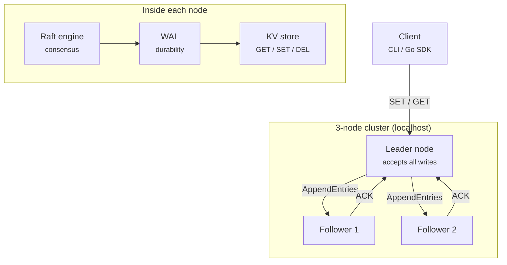

## Description

> - `GoRaft` is a distributed key-value store built in Go, powered by the Raft consensus algorithm.
> - This is a personal project exploring distributed systems fundamentals.

 

`High Level Architecture`

 
 
 

