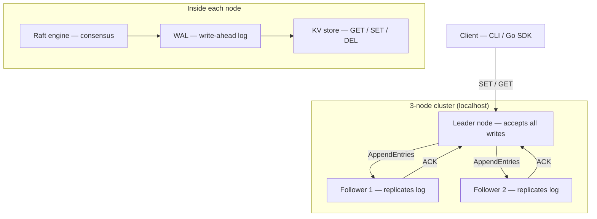

# High-Level Architecture

 

```mermaid
graph TD
    Client["Client — CLI / Go SDK"]

    Client -->|SET / GET| Leader

    subgraph Cluster ["3-node cluster (localhost)"]
        Leader["Leader node — accepts all writes"]
        F1["Follower 1 — replicates log"]
        F2["Follower 2 — replicates log"]

        Leader -->|AppendEntries| F1
        Leader -->|AppendEntries| F2
        F1 -->|ACK| Leader
        F2 -->|ACK| Leader
    end

    subgraph Inside ["Inside each node"]
        Raft["Raft engine — consensus"]
        WAL["WAL — write-ahead log"]
        KV["KV store — GET / SET / DEL"]

        Raft --> WAL
        WAL --> KV
    end
```
